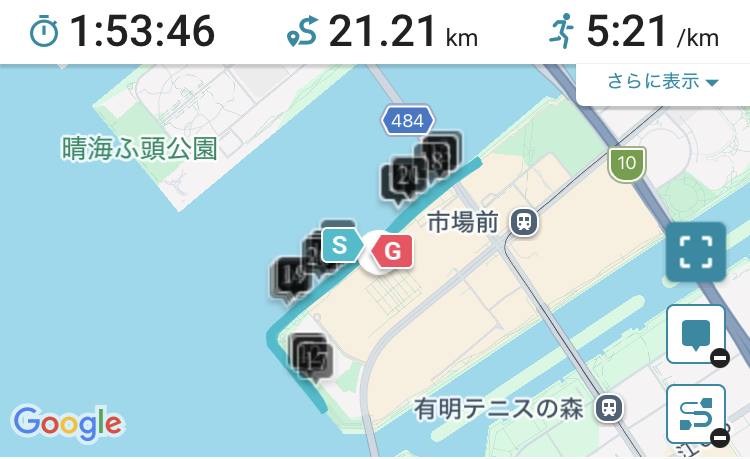
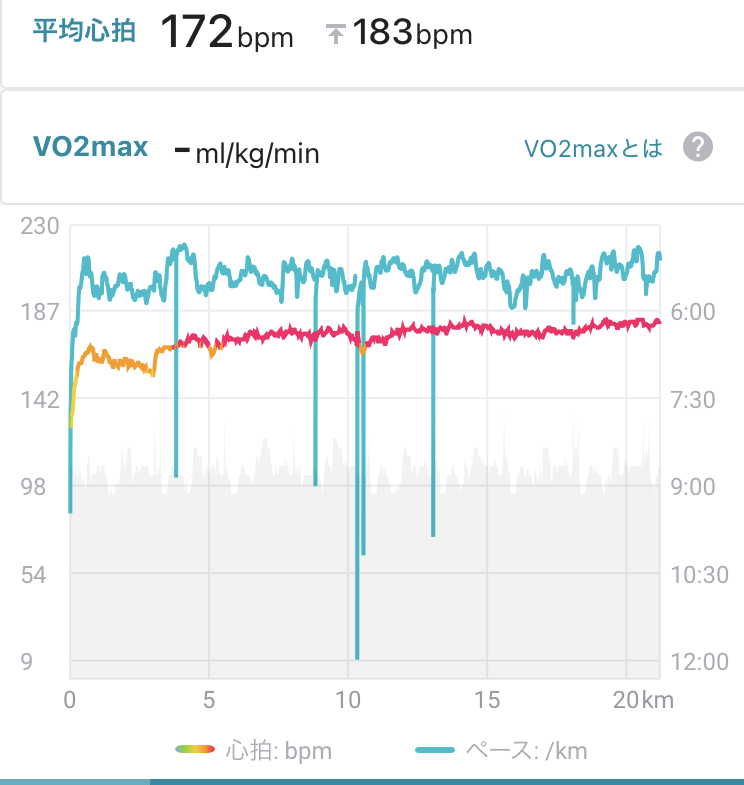

9/5の土曜日にハーフマラソンを走ってきました。初ハーフラマラソン。

大会は[豊洲のナイトマラソン](https://sportsone.jp/running/toyosu-night/index.html)でした。こちらも初参加。  
ぐるぐるするタイプのやつですね。

これは手元の公式では1:53:35とかだったはず。

データで見てもわかるように、5km頃から165を超えつつ170に到達したまま行ってたので相当出し切った形になりました。

当初は2時間で行けるくらいだからフルマラソンで言うところのサブ4ペースの5:40/kmくらいで走れたら嬉しいかなくらいに思ってました。
5:30/kmくらいで入って、これで行って大丈夫かなと伺いつつ、2時間のペーサーの方の後ろをついて行ってたのですが、もうちょっと上げてみるかと思って少し上げつつ。途中で上げ過ぎかなと思ったんですが、20kmならまぁ頑張れるかと思って。

コースがぐるぐるの同じ2kmを周回する場所で、2時間のペーサーの方を抜かして、ちょっと上げ始めたくらいで1時間55分のペーサーの集団が反対側でどれくらいか見えてたんで、そこの集団を目標に目指すかと思い5:20くらいでしばらく走ってました。  
それで10km地点あたりで補給しようとジェムを口にしたんですが、気管の変なところに入って立ち止まってしまいました。呼吸が細くなって、「あ、倒れちゃうかも」と思ったんですが、ゆっくり歩きつつ呼吸を戻して、なんとか給水のエイドまで行って、事なきを得たんですが、それが本当にキツかったですね。上げすぎてる時はジェムの取り方気をつけようと思いました。呼吸できなくなってパニックになったので相当こわかったです。その後ジェムの補給はちょっとビビってできませんでしたしね。

それ以降は足の裏が張ってる感覚をちょっとごまかしながら5:15〜5:25/kmを保ちつつ。16kmあたりで1時間55分のペーサー集団を捉えた時は嬉しかったですね。2時間のペーサー集団を抜かしてから追いつくまで本当に長かった。ハーフの5分を縮める苦しさを知りました。これはちょっとフルとは感覚違うなと。

1時間55分のペーサー集団にしばらく着いて行って、20kmあたりでもうちょっと頑張れるかもと思い、振り切って20~
21kmは5:08/kmと21〜22kmは5:11/kmとかなり頑張れました。あそこで上げきれたのは相当自信になりました。

1時間53分て[早見表](https://www.k-kouno.co.jp/laptime.html)で言うとフルは3時間45分狙えるかもくらいの見方ができるかもなんですけど、これはちょっと厳しそうだなと思いました。ハーフだからここまで出し切れるものの、フルでこれを出す、あるいは5:30/kmで走り抜けるみたいなのは現状厳しいなと。  
出し切れたのはめちゃくちゃ良くて、手応えも良かったんですが、フルはまた変わるなと。

走り終えた後は一緒にエントリーした初大会参加の同僚を励ましながら。みんな完走できてよかったです。

ナイトマラソン、同じところをぐるぐるなのでつまらないかもな、と思ったんですが、序盤の夕暮れていくところも、終盤の日が完全に落ちてタワマンがネオンになる感じも良くて、かなり気持ちよかったです。  
天気も雨上がりの涼しげで、運営の方々の声かけも良く、良い大会でした。または知りたいですね。

今シーズンの開始が良い感じだったのは良かったですね。自信にもなり、もう少し練習頑張ろうという気持ちになりました。  
最終的にはフルで3時間45分を目指せるように頑張りたいですね。精進します。
